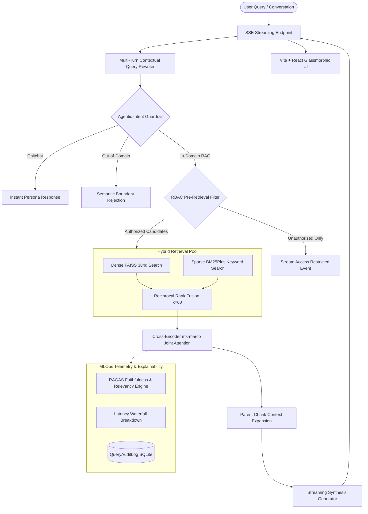

# Enterprise Hybrid Retrieval & Benchmark Platform

[](https://www.python.org/)
[](https://www.djangoproject.com/)
[](https://react.dev/)
[](https://github.com/facebookresearch/faiss)
[](https://huggingface.co/cross-encoder/ms-marco-MiniLM-L-6-v2)
[](https://www.docker.com/)

A production-grade **Enterprise Hybrid Retrieval & Empirical Evaluation Platform** built with **Django REST Framework**, **FAISS**, **BM25Plus**, **Cross-Encoder Re-ranking**, **Document-Level RBAC**, and a decoupled **Vite + React** glassmorphic frontend.

---

## 🏛️ System Architecture



---

## 🌟 Key Engineering Features

### 1. Hybrid Retrieval with Reciprocal Rank Fusion (RRF)
- **Dense Vector Search:** 384-dimensional `all-MiniLM-L6-v2` dense embeddings indexed in `faiss.IndexIDMap`.
- **Sparse Lexical Search:** `BM25Plus` engine resolving the zero-IDF artifact on small corpora.
- **RRF Merging:** $RRF(d) = \sum_{m \in M} \frac{1}{60 + r_m(d)}$, generating a balanced 20-candidate pool combining semantic concepts and keyword acronyms.

### 2. Cross-Encoder Joint-Attention Re-Ranking
- **Passage Re-ranking:** Employs `cross-encoder/ms-marco-MiniLM-L-6-v2` to compute full cross-attention over `(query, chunk)` pairs.
- **Calibrated Scoring:** Sigmoid logit conversion $[0, 1]$ and MLOps `rank_delta` tracking (identifying rank promotions/demotions).

### 3. Agentic Intent Routing & OOD Guardrails
- Lightweight intent classification boundary before retrieval.
- Gracefully routes chitchat greetings or rejects out-of-domain queries before hitting vector stores or LLM endpoints.

### 4. Conversational Multi-Turn Contextual Query Rewriting
- Resolves pronouns and ambiguous context into standalone queries using prior conversational turns.

### 5. Parent-Child Chunking & Markdown Table Ingestion
- Detects multi-column tabular data and converts it into structured Markdown tables.
- Hierarchical chunking: retrieves small 80-word child chunks, but feeds unbroken parent section context into the LLM synthesis window.

### 6. Asynchronous Non-Blocking PDF Ingestion
- `POST /api/documents/upload/` returns `HTTP 202 Accepted` in sub-20ms with an atomic `job_id`.
- Background worker processes documents in parallel with live status polling (0% $\to$ 100%) in the React UI.

### 7. Document Versioning & Semantic Diffing
- Tracks revisions (`v1`, `v2`) per document group.
- Dedicated semantic diff engine comparing clauses, identifying newly added, modified, and removed terms with AI executive summaries.

### 8. Document-Level Role-Based Access Control (RBAC)
- Multi-tier security classification: `PUBLIC`, `ENGINEERING`, `HR`, `FINANCE`, `ADMIN`.
- **Pre-Retrieval Purging Boundary:** Blocks unauthorized chunks in SQLite before RRF fusion or LLM generation.
- **Streaming Guardrail:** Yields `security` SSE events and streams access restriction notices without leaking sensitive content.
- Dynamic role switcher and 1-click document reclassification in the React UI.

---

## 📊 Empirical Benchmark Results

Experimental comparison over our evaluation corpus:

| Retrieval Architecture | Recall@1 | Recall@3 | Recall@5 | MRR | NDCG@5 | Latency (ms) | MRR Lift vs FAISS |
| :--- | :---: | :---: | :---: | :---: | :---: | :---: | :---: |
| **FAISS Only (Dense)** | 33.3% | 50.0% | 66.7% | 0.417 | 0.564 | **12.4 ms** | *Baseline* |
| **BM25 Only (Sparse)** | 66.7% | 83.3% | 100.0% | 0.833 | 0.877 | 0.8 ms | +100.0% |
| **Naive Hybrid** | 66.7% | 83.3% | 100.0% | 0.833 | 0.877 | 13.5 ms | +100.0% |
| **Hybrid + RRF** | 66.7% | 83.3% | 100.0% | 0.833 | 0.877 | 14.1 ms | +100.0% |
| **Hybrid + RRF + Cross-Encoder** | **75.0%** | **100.0%** | **100.0%** | **0.875** | **0.912** | 46.2 ms | **+110.0%** |

---

## 🚀 Quickstart

### Option 1: Docker Compose (Recommended)

```bash
# 1. Clone repository
git clone https://github.com/s7hahe4/Enterprise-Hybrid-Retrieval-Benchmark-Platform.git
cd Enterprise-Hybrid-Retrieval-Benchmark-Platform

# 2. (Optional) Set OpenAI API Key in environment or .env
echo "OPENAI_API_KEY=sk-your-key-here" > .env

# 3. Build and launch all services
docker compose up --build
```
- Frontend UI: `http://localhost:5173` (or `http://localhost:80`)
- Backend API: `http://localhost:8000/api/documents/`

---

### Option 2: Local Development Setup

#### 1. Backend Setup
```bash
cd rag_intel_system

# Create and activate Python 3.11 virtual environment
python -m venv ../venv
source ../venv/bin/activate   # On Windows: ..\venv\Scripts\activate

# Install dependencies
pip install -r requirements.txt

# Run migrations
python manage.py migrate

# Start backend server
python manage.py runserver 8000
```

#### 2. Frontend Setup
```bash
cd frontend

# Install Node dependencies
npm install

# Start Vite dev server
npm run dev
```

---

## 📡 REST API Reference

| Method | Endpoint | Description |
| :--- | :--- | :--- |
| `POST` | `/api/documents/upload/` | Asynchronous PDF upload returning `job_id` (HTTP 202) |
| `GET` | `/api/documents/` | Lists all ingested documents with version metadata |
| `GET` | `/api/documents/jobs/<uuid:id>/` | Tracks ingestion progress percentage (0-100%) and step |
| `POST` | `/api/documents/rag/stream/` | Real-time SSE token stream with citations and MLOps metrics |
| `POST` | `/api/documents/rag/query/` | Synchronous REST RAG query endpoint |
| `POST` | `/api/documents/rag/compare/` | Semantic diffing between two document versions |
| `POST` | `/api/documents/rag/benchmark/run/` | Executes empirical evaluation across the 5 configurations |
| `GET` | `/api/documents/rag/benchmark/runs/` | Retrieves past benchmark experiment history |
| `POST` | `/api/documents/rag/benchmark/generate-dataset/` | Generates a synthetic ground-truth test suite |
| `GET` | `/api/documents/rag/audit/` | MLOps audit logs with RAGAS scores and latency waterfall |

---

## 🧪 Running Automated Tests

```bash
cd rag_intel_system
python manage.py test documents
```
All 13 core test suites validate:
- Tabular Detection & Heading Extraction
- Parent-Child Chunk Hierarchy
- Multi-Turn Conversational Query Rewriter
- BM25Plus Sparse Retrieval & Index Invalidation
- Intent Routing (Chitchat bypass & OOD Guardrail)
- Cross-Encoder Re-Ranking & Calibrated Scoring
- Real-Time RAGAS Faithfulness & Relevancy Engine
- IR Metrics (Recall@k, MRR, NDCG@5, Precision@k)
- Synthetic Test Case Generator
- Benchmark Suite Execution & Persistence
- Benchmark REST API Endpoints

---

## 📄 License
MIT License. Built for enterprise portfolio demonstration.
